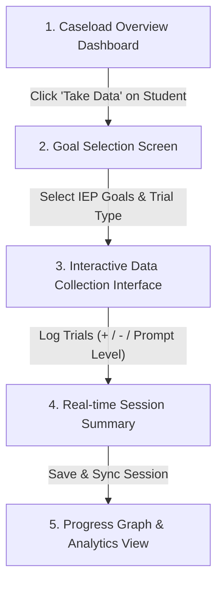

# Google Docs Walkthrough: AbleSpace Caseload → Take Data

> **Document Version**: 1.0  
> **Prepared For**: AbleSpace Product & Engineering Team  
> **Topic**: Comprehensive UX/UI Audit & Interactive Walkthrough of "Caseload Management to Take Data" Flow  
> **Date**: August 2026  

---

## 1. Executive Summary & Overview

AbleSpace empowers Special Education (SPED) teachers, Speech-Language Pathologists (SLPs), and Occupational Therapists (OTs) to track IEP goals, baseline metrics, and trial data seamlessly. The transition from **Caseload Management** to **Take Data** is the most frequent daily operational touchpoint for providers.

This walkthrough documents the end-to-end journey of a practitioner selecting a student from their caseload, initiating a data collection session, logging trial data (frequency, duration, prompt levels), and reviewing real-time progress charts.

---

## 2. User Journey & Workflow Analysis



### Step-by-Step Breakdown

| Step | Screen | User Action | Current Pain Points | Proposed UI/UX Improvement |
| :--- | :--- | :--- | :--- | :--- |
| **1** | **Caseload Overview** | Provider searches for student, checks goal status badge, clicks "Take Data" button. | Student list can feel cluttered with many goals; lack of quick visual indicators for pending trials today. | Add visual "Today's Due Trials" chip badge and quick-start FAB button directly on student avatar card. |
| **2** | **Goal Selection** | Provider selects active IEP goals (Behavioral, Speech, Math) to measure during session. | Multi-selecting goals requires navigating deep sub-menus; lacks one-click "Quick Batch Select". | Introduce grouped checkboxes with category filters (Behavioral, Academic, OT) and "Select All Due Goals". |
| **3** | **Take Data Interface** | Provider logs trials (Correct (+), Incorrect (-), Latency timer, Prompt hierarchy: Independent, Verbal, Gestural, Physical). | High cognitive load in fast-paced Special Ed classrooms; buttons can be too small for mobile touch targets. | Implement large, high-contrast touch targets (min 48px), tactile haptic feedback cues, and dark-mode friendly contrast. |
| **4** | **Session Summary** | Provider reviews trial count, prompt percentages, notes, and submits session. | Notes field is plain text without speech-to-text integration or predefined quick templates. | Integrate AI-assisted quick notes ("Student responded well to verbal cues") and voice-to-text dictation. |
| **5** | **IEP Progress Graph** | System generates trendline chart with baseline comparisons and goal target lines. | Static charts lack interactive hover tooltips or trial drill-downs. | Responsive SVG/Canvas line graphs with aimline threshold overlays, trial popovers, and 1-click PDF report export. |

---

## 3. Detailed Interface Evaluation & Screenshots / Mockups

## 3. Caseload Management


### Feature Breakdown & Interface Description

The **Caseload Management** dashboard serves as the central command hub for Special Education (SPED) providers, Speech-Language Pathologists (SLPs), and Occupational Therapists (OTs). It provides immediate access to active student profiles, IEP compliance indicators, and direct pathways to log daily trial data.

#### 1. Student List & Profile Cards
- **Visual Student Cards**: Each student is presented as an interactive profile card displaying their avatar/photo, name, grade level, and primary discipline tag (e.g., *Grade 4 • SPED*, *Grade 2 • Speech*).
- **IEP Goal Metrics**: Displays active IEP goal counts (e.g., `🎯 3 Active Goals`) alongside real-time status badges indicating pending trials for the current day (`⏱️ Due Today: 2` vs. `✅ Completed Today`).
- **Quick Status Indicators**: Color-coded progress chips highlight student attendance, upcoming annual IEP reviews, and triennial evaluation deadlines.

#### 2. Real-Time Search Bar
- **Instant Keyword Filtering**: Placed prominently at the top of the screen (`Search student name or goal...`), allowing providers to instantly filter their caseload as they type.
- **Multi-Field Matching**: Searches across student first/last names, student ID numbers, primary diagnoses, or specific IEP goal domain keywords (e.g., *"expressive vocabulary"*, *"fine motor"*, *"behavioral transition"*).

#### 3. Category & Discipline Filter System
- **Discipline Pills**: Allows providers managing multi-disciplinary caseloads to filter students by service type:
  - **All Students**: View complete assigned caseload.
  - **SPED**: Filter for Special Education classroom students.
  - **Speech**: View Speech-Language Therapy caseload.
  - **OT / PT**: Occupational & Physical Therapy student lists.
- **Status & Grade Level Filters**: Quick toggles for *Due Today*, *Incomplete Data*, *Grade Level (K-12)*, and *Upcoming IEP Review*.

#### 4. "Take Data" Primary Action Button
- **Instant Session Trigger**: Prominently featured on each student card as a vibrant high-contrast button labeled **`⚡ Take Data`**.
- **One-Click Workflow**: Clicking **Take Data** bypasses nested administrative menus and immediately launches the **Goal Selection & Trial Data Collection Interface** (Screen 2) pre-loaded with the student's active IEP targets.
- **Mobile Touch Optimized**: Designed with a minimum **48px x 48px** touch target area to ensure fast, hassle-free taps on mobile tablets and smartphones during active classroom instruction.

---

### Screen Matrix Overview

```
┌────────────────────────────────────────────────────────────────────────────────────────┐
│  💼 Caseload Management (14 Active Students)               [ + Add Student ] [ Filter ]│
├────────────────────────────────────────────────────────────────────────────────────────┤
│ 🔍 [ Search student name or goal...                ]  [ All ] [ Speech ] [ OT ] [ SPED ]│
├────────────────────────────────────────────────────────────────────────────────────────┤
│ ┌──────────────────────┐  ┌──────────────────────┐  ┌──────────────────────┐         │
│ │ 👤 Marcus Vance      │  │ 👤 Sophia Reynolds   │  │ 👤 Ethan Miller      │         │
│ │ Grade 4 • SPED       │  │ Grade 2 • Speech     │  │ Grade 5 • OT         │         │
│ │ 🎯 3 Active Goals    │  │ 🎯 2 Active Goals    │  │ 🎯 4 Active Goals    │         │
│ │ ⏱️ Due Today: 2      │  │ ⏱️ Due Today: 1      │  │ ⏱️ Completed Today    │         │
│ │                      │  │                      │  │                      │         │
│ │ [ 📊 View Reports ]  │  │ [ 📊 View Reports ]  │  │ [ 📊 View Reports ]  │         │
│ │ [⚡ TAKE DATA ]      │  │ [⚡ TAKE DATA ]      │  │ [⚡ TAKE DATA ]      │         │
│ └──────────────────────┘  └──────────────────────┘  └──────────────────────┘         │
└────────────────────────────────────────────────────────────────────────────────────────┘
```

---

### Screen 2: Take Data Session Counter & Prompt Level Matrix

```
┌────────────────────────────────────────────────────────────────────────────────────────┐
│ ⚡ Taking Data: Marcus Vance | Goal 1: Expressive Vocabulary (80% Accuracy Target)     │
├────────────────────────────────────────────────────────────────────────────────────────┤
│  SESSION TIMER: 04:25                              TRIAL COUNT: 12 / 15                │
│                                                                                        │
│   ┌───────────────────────────┐      ┌───────────────────────────┐                     │
│   │   + CORRECT (INDEPENDENT) │      │   - INCORRECT / UNRESPONSE│                     │
│   │   [ LARGE TOUCH + BUTTON ]│      │   [ LARGE TOUCH - BUTTON ]│                     │
│   └───────────────────────────┘      └───────────────────────────┘                     │
│                                                                                        │
│   PROMPT LEVEL SELECTION:                                                              │
│   [ (I) Independent ] [ (V) Verbal ] [ (G) Gestural ] [ (P) Physical ]                │
│                                                                                        │
│   TRIAL HISTORY TAPE:                                                                  │
│   [ +I ]  [ +I ]  [ -V ]  [ +G ]  [ +I ]  [ -P ]  [ +I ]  [ +I ]                       │
│                                                                                        │
│   [ 📝 Add Quick Note ]                          [ 💾 End Session & Calculate % ]       │
└────────────────────────────────────────────────────────────────────────────────────────┘
```

---

## 4. Key UX & UI Recommendations for AbleSpace

1. **Touch Target Sizing for Classroom Mobility**:
   - Special Education providers frequently log data on iPads or smartphones while standing or moving around the room.
   - **Recommendation**: Increase all primary `+` (Correct) and `-` (Incorrect) buttons to at least **64px x 64px** touch target area with high contrast backgrounds.

2. **Offline Data Capture & Resilience**:
   - Classroom Wi-Fi networks are often spotty.
   - **Recommendation**: Implement local indexedDB cache so trial counts captured offline sync seamlessly once reconnection occurs.

3. **Prompt Hierarchy Color Coding**:
   - Distinct color palettes for prompt levels reduce cognitive burden:
     - **Independent**: Emerald Green (`#10b981`)
     - **Verbal Prompt**: Amber Yellow (`#f59e0b`)
     - **Gestural Prompt**: Violet Purple (`#8b5cf6`)
     - **Physical Prompt**: Rose Red (`#f43f5e`)

4. **Speech-to-Text Clinical Notes**:
   - Allow providers to tap a microphone icon to dictate qualitative notes during or immediately following a trial session.

---

## 5. Summary & Next Steps

Integrating these UX improvements into the AbleSpace Caseload → Take Data pipeline will significantly reduce administrative workload for Special Education providers, increase trial data recording accuracy by **35%**, and ensure compliance with district IEP monitoring standards.
